---
tags:
  - mapa
  - projeto
  - grafico
---

# Mapa do Projeto izcode

Este painel organiza a visualiza??o do projeto sem o ru?do dos READMEs de depend?ncias.

> Filtro aplicado no grafo do Obsidian: `-path:node_modules -path:dist -path:.git`  
> Tamb?m deixei `node_modules/` e `dist/` em arquivos exclu?dos do vault.

## README principal

- [[readme.md]] ? documenta??o principal do projeto.

## Vis?o geral em gr?fico

```mermaid
graph TD
  README["readme.md"] --> APP["src/App.tsx"]
  MAIN["src/main.tsx"] --> APP
  APP --> INDEX["src/pages/Index.tsx"]
  APP --> NOTFOUND["src/pages/NotFound.tsx"]
  APP --> THEME["src/hooks/use-theme.ts"]
  APP --> UI_TOASTER["src/components/ui/toaster.tsx"]
  APP --> UI_SONNER["src/components/ui/sonner.tsx"]
  APP --> UI_TOOLTIP["src/components/ui/tooltip.tsx"]

  INDEX --> NAVBAR["src/components/Navbar.tsx"]
  INDEX --> HERO["src/components/Hero.tsx"]
  INDEX --> MARQUEE["src/components/AwfulMarquee.tsx"]
  INDEX --> STATEMENT["src/components/StatementZoom.tsx"]
  INDEX --> TERMINAL["src/components/DemoTerminal.tsx"]
  INDEX --> SERVICES["src/components/Services.tsx"]
  INDEX --> FEATURE["src/components/Feature.tsx"]
  INDEX --> CTA["src/components/CallToAction.tsx"]
  INDEX --> FOOTER["src/components/Footer.tsx"]

  NAVBAR --> NAVHOOK["src/hooks/useNavbarScrollTrigger.ts"]
  HERO --> CONTACT["src/lib/contact.ts"]
  HERO --> GSAP["src/lib/gsap.ts"]
  HERO --> NEURAL["src/components/NeuralHeroBackground.tsx"]
  TERMINAL --> TERMHOOK["src/hooks/useDemoTerminalGsap.ts"]
  SERVICES --> REVEAL["src/hooks/useScrollReveal.ts"]
  FEATURE --> REVEAL
  CTA --> REVEAL
  FOOTER --> REVEAL
  NAVBAR --> CONTACT
  SERVICES --> CONTACT
  FEATURE --> CONTACT
  CTA --> CONTACT
  FOOTER --> CONTACT

  REVEAL --> GSAP
  NAVHOOK --> GSAP
  TERMHOOK --> GSAP

  UI["src/components/ui/*"] --> UTILS["src/lib/utils.ts"]

  classDef doc fill:#ffe4b5,stroke:#d97706,color:#111;
  classDef entry fill:#dbeafe,stroke:#2563eb,color:#111;
  classDef page fill:#dcfce7,stroke:#16a34a,color:#111;
  classDef component fill:#f3e8ff,stroke:#9333ea,color:#111;
  classDef hook fill:#e0f2fe,stroke:#0284c7,color:#111;
  classDef lib fill:#ffedd5,stroke:#ea580c,color:#111;
  class README doc;
  class MAIN,APP entry;
  class INDEX,NOTFOUND page;
  class NAVBAR,HERO,MARQUEE,STATEMENT,TERMINAL,SERVICES,FEATURE,CTA,FOOTER,NEURAL,UI,UI_TOASTER,UI_SONNER,UI_TOOLTIP component;
  class THEME,NAVHOOK,TERMHOOK,REVEAL hook;
  class CONTACT,GSAP,UTILS lib;
```

## Agrupamento sugerido

- **Entrada:** [[src/main.tsx]] ? [[src/App.tsx]]
- **P?ginas:** [[src/pages/Index.tsx]], [[src/pages/NotFound.tsx]]
- **Se??es da landing page:** [[src/components/Navbar.tsx]], [[src/components/Hero.tsx]], [[src/components/Services.tsx]], [[src/components/Feature.tsx]], [[src/components/CallToAction.tsx]], [[src/components/Footer.tsx]]
- **Hooks:** [[src/hooks/useScrollReveal.ts]], [[src/hooks/useDemoTerminalGsap.ts]], [[src/hooks/useNavbarScrollTrigger.ts]]
- **Bibliotecas internas:** [[src/lib/contact.ts]], [[src/lib/gsap.ts]], [[src/lib/utils.ts]]
- **UI reutiliz?vel:** [[src/components/ui/button.tsx]], [[src/components/ui/dialog.tsx]], [[src/components/ui/toaster.tsx]] e demais arquivos em [[src/components/ui]]

## Observa??o

Os muitos arquivos `README.md` vinham principalmente de `node_modules`, n?o da documenta??o real do projeto. Para manter o grafo ?til, essa pasta foi exclu?da da visualiza??o.
